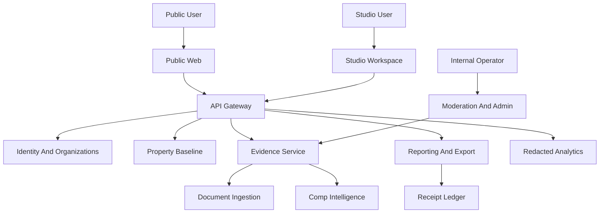

# Production Architecture Packet

This packet defines the target service boundaries for a production Sophex marketplace.
It does not authorize runtime implementation, database schema work, migrations, generated clients, queues, provider sends, or deploys.

## Architecture Principles

- Separate public marketplace surfaces from authenticated Studio workspace surfaces.
- Enforce permissions at the API/query layer, not through UI hiding.
- Keep observations, evidence, documents, chunks, operational receipts, audit events, notes, comments, and projections as separate concepts.
- Treat sister-project schema as a future contract input, not a direct database dependency.
- Fail closed on source rights, visibility, export eligibility, and idempotency.

## Target Runtime Boundaries

| Boundary | Responsibility | Forbidden coupling |
| --- | --- | --- |
| Public Web | Public property pages, search, public comps, report previews, upload/contribution entry points. | No direct private observation reads; no raw document access. |
| Studio Workspace | Authenticated broker workflow: deals, intake, comps, underwriting, reports, branding, billing. | No client-side-only permission enforcement. |
| Identity And Organizations | Users, sessions, org membership, roles, source-owner identity, partner/API actors. | No implicit mapping from sister-project internal roles to public marketplace roles. |
| Evidence Service | Observations, lineage, source metadata, review state, visibility, public projections. | No document bytes as business truth; no queue-as-truth promotion. |
| Document Ingestion | Upload metadata, file identity, validation, extraction candidates, OCR/chunk sidecars, HITL review. | No public promotion from raw OCR/chunks. |
| Property Baseline | Lawful public baseline property facts and approved public aggregates. | No private comp/user upload leakage. |
| Comp Intelligence | Comparable sales, provider rights, verification, adjustments, source restrictions. | No provider-restricted facts in public exports. |
| Reporting And Export | Section review, source-rights filtering, export generation, receipts, share/download audit. | No ungated exports or non-idempotent sends. |
| Billing And Entitlements | Plan selection, paid features, quota, premium source entitlements. | No plan-only access without evidence visibility policy. |
| Analytics | Redacted product telemetry, funnels, performance, error signals. | No raw PII, private comp values, document content, or source-owner identity. |
| Moderation And Admin | Review queues, disputes, corrections, privacy requests, publication holds, incident response. | No public exposure of internal logs or raw operator details. |

## Conceptual Data Flow

## API Boundary Decisions

Future APIs should be designed around contracts before schema:

- Every governed write accepts an idempotency key.
- Every governed write returns a receipt reference.
- Every read is scoped by actor, organization, source ownership, visibility, entitlement, and source rights.
- Every displayed value can explain why it is visible and what source posture supports it.
- Every export/share/download request evaluates source-rights filters and report section approval before artifact generation.
- Every analytics event is redacted before leaving the app boundary.

## Sister-Project Dependency Map

| Sister concept | Use later as | Sophex-specific translation |
| --- | --- | --- |
| Relationship truth doctrine | Doctrine for separating evidence, notes, comments, activities, receipts, and projections. | Public marketplace must never flatten these into one visible feed. |
| Document evidence registry | Contract inspiration for file refs, hashes, review/promotion, supersession, freshness, receipts. | Must add source-owner visibility, contribution terms, and marketplace publication states. |
| Staged import review | Workflow pattern for upload -> candidates -> review -> promotion. | Must include contributor consent and public/private marketplace boundaries. |
| Source citations and provenance cells | UI/API contract inspiration for explaining displayed values. | Must redact private source names and facts when actor lacks permission. |
| BOV/report export gates | Report section and source-rights patterns. | Must include public export, marketplace, and share-link policy. |
| Operational receipts | Audit/idempotency reference. | Public users see sanitized receipt refs, not raw internal logs. |

## Readiness Gates

Before runtime implementation:

1. Architecture packet reviewed.
2. Evidence/permission contracts approved.
3. Sister-project schema borrow gate approved when source project is stable.
4. Security/privacy launch gates approved.
5. Sandbox runtime scope approved separately.

Until those gates clear, this remains a docs-only target architecture.
