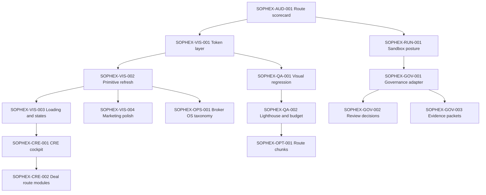

# Sophex Visual And Runtime Integration Matrix

Date: 2026-05-26

Status: living tracker

## Purpose

This document is the working matrix for the next Sophex upgrade wave. It keeps two streams coordinated:

1. Keep the public Sophex marketplace and Finem CRE Studio visual system at the standard set by the strongest sister projects, especially ICSC Map Recovery and cre-platform.
2. Layer sandbox, contract, provider, and governed runtime capabilities into existing customer-facing routes without exposing raw internal engine concepts.

This is a planning and progress tracker, not runtime approval. It does not authorize schema changes, migrations, generated clients, deploys, production writes, provider calls, queue launches, live Fabricator execution, billing, exports, autonomous approvals, or `.env` usage. Those lanes remain gated by the approval packets linked below.

## Source Of Truth Map

| Document | Role | This matrix should not replace |
| --- | --- | --- |
| [WORLD_CLASS_PROTOTYPE_SPEC.md](./WORLD_CLASS_PROTOTYPE_SPEC.md) | Product route specification and launch posture | Route intent, data posture, product invariants |
| [MOCK_RESOLUTION_REGISTRY.md](./MOCK_RESOLUTION_REGISTRY.md) | Mock-only inventory and resolution lanes | Per-fixture replacement checklist |
| [RAPID_BUILD_TICKET_INVENTORY_2026-05-25.md](./RAPID_BUILD_TICKET_INVENTORY_2026-05-25.md) | Historical Wave 1-16 implementation ledger | Completed wave provenance |
| [VISUAL_DESIGN_SYSTEM.md](./VISUAL_DESIGN_SYSTEM.md) | Visual token and sister-project harvest reference | Token definitions and visual principles |
| [SOPHEX_GATED_LANES_APPROVAL_PACKET.md](./SOPHEX_GATED_LANES_APPROVAL_PACKET.md) | Operator approval packet for gated runtime lanes | Schema, provider, queue, deploy authorization |
| [IMPLEMENTATION_QUALITY_DISCIPLINE.md](./IMPLEMENTATION_QUALITY_DISCIPLINE.md) | Quality command discipline | Which checks are required for each change class |

## Product Framing

| Product area | Audience | Visual target | Runtime posture |
| --- | --- | --- | --- |
| Public marketplace | Brokers, owners, analysts, contributors, external readers | Evidence-first CRE intelligence, warm institutional trust, clear authority labels | Public baseline, candidate evidence, fixture or sandbox reads only |
| Public report/export | External report viewers and governed delivery flows | Presentation-grade report cards, readiness rails, blocker clarity | Mock receipts and disabled gates until review, consent, source-rights, and receipt contracts exist |
| Finem CRE Studio | Brokers, analysts, sponsors, investment teams | Premium vertical workspace with institutional tables, bento cockpit, report/export polish | CRE-specific fixture or sandbox adapters behind mock boundaries |
| Studio marketing/settings | Prospective Studio customers and tenant admins | Premium SaaS marketing, plan and branding clarity, no generic blue drift | Marketing/fixture only until billing, auth, tenant branding, and consent gates clear |
| Broker OS lite | Internal/operator-adjacent reviewers | Clean sanitized operator projection, not public Studio chrome | Projection only; raw queues, logs, worker IDs, secrets, and PII stay internal |
| Design reference | Product/design/engineering team | Live token and component reference | Reference-only; no product state |

Customer-facing Sophex language should use: `evidence`, `authority`, `review`, `source rights`, `readiness`, `reports`, `valuation snapshots`, `analyst review`, `permissions`, `gates`, `receipt`, `Studio`, `public baseline`, `candidate evidence`, `reviewed`.

Customer-facing Sophex language should avoid: `Fabricator`, `MCP`, `Taskmaster`, raw queue names, raw runtime IDs, raw run logs, raw policy internals, provider secrets, worker IDs, or any phrase implying queue completion equals evidence or export authority.

## Status Legend

| Status | Meaning |
| --- | --- |
| `Done` | Implemented and validated against current prototype expectations. |
| `Mostly done` | Core work is implemented; smaller polish, doc sync, or broader coverage remains. |
| `Partial` | A usable slice exists, usually fixture or sandbox-backed, but the route is not fully layered. |
| `Ready` | Direction and dependencies are clear enough to start. |
| `Blocked` | Waiting on operator approval, schema, auth, policy, provider, or governance decisions. |
| `Deferred` | Intentionally postponed; not a current build target. |
| `N/A` | Not applicable to Sophex. |

## Scoring Rubric

| Score | Visual maturity | Runtime/capability posture |
| --- | --- | --- |
| `A` | Premium, tokenized, motion-aware, responsive, visually covered. | Fixture or sandbox posture is explicit and correctly gated; no production claim. |
| `B` | Solid and usable, but has remaining hero, density, state, or mobile polish. | Mock/sandbox behavior is clear but needs stronger contract, receipt, or adapter layering. |
| `C` | Functional but still basic or uneven compared with target sister projects. | Mostly static/mock with limited resolution path shown in the UI. |
| `Blocked` | Visual work depends on runtime, policy, or product decision. | Requires gated lane approval before implementation. |

## Route Coverage Checklist

### Public Marketplace

| Route | File | Classification | Visual score | Runtime score | Current posture | Next visual work | Runtime/capability work | Status |
| --- | --- | --- | --- | --- | --- | --- | --- | --- |
| `/` | `prototype/src/pages/LandingPage.tsx` | Public marketplace | A | B | Public shell has forest chrome, proof strip, source-trust panel, runtime posture chip. | Continue conversion hierarchy if GTM becomes active. | Keep fixture/sandbox public search until data-source contracts and analytics redaction clear. | Mostly done |
| `/property/:id` | `prototype/src/pages/PropertyPage.tsx` | Public marketplace | A | B | Authority labels, map HUD, evidence drawer, empty spatial/evidence states, runtime shells. | Tune mobile map drawer density further if spatial expands. | Server-side field resolution, permissioned evidence, spatial source-rights. | Mostly done |
| `/property/:id/comps` | `prototype/src/pages/CompsPage.tsx` | Public marketplace | A | B | Saved comp views, filter-empty states, dense table, map/list context, blocked/private labels. | Provider adapter styling when approval lane opens. | Provider rights, comp source restrictions, private-value isolation. | Mostly done |
| `/comps` | `prototype/src/pages/CompsPage.tsx` | Guard route | B | A | Guard pattern with no data exposure. | No major visual work. | Keep as guard. | Done |
| `/upload` | `prototype/src/pages/UploadPage.tsx` | Public contribution | A- | C | Consent copy, simulated upload progress, candidate-evidence result, a11y progress tests. | Add richer empty/error file states if live upload is approved. | File scanning, storage, source metadata, extraction candidates, review gates. | Blocked |
| `/report/:id` | `prototype/src/pages/ReportPage.tsx` | Public report | A | B | Readiness rail, section posture strip, empty-section state, public/studio continuity. | Receipt visuals once immutable snapshot contract exists. | Permission-filtered source bundles and section review state. | Mostly done |
| `/export/:id` | `prototype/src/pages/ExportPage.tsx` | Public export gate | A | C | Consent, blockers, mock receipt, manifest, boundary banners, visual snapshot. | Keep blocker hierarchy reviewed as more receipt states are designed. | Idempotent receipts, source-rights filtering, legal consent, governed export. | Blocked |

### Finem CRE Studio And Settings

| Route | File | Classification | Visual score | Runtime score | Current posture | Next visual work | Runtime/capability work | Status |
| --- | --- | --- | --- | --- | --- | --- | --- | --- |
| `/studio` | `prototype/src/pages/studio/MarketingRoutes.tsx` | Studio marketing | A- | B | Standalone marketing shell, proof strips, workflow outcome cards, presentation toggle. | Branded onboarding side preview if GTM becomes active. | Auth-aware routing and conversion analytics redaction. | Mostly done |
| `/studio/onboarding` | `prototype/src/pages/studio/MarketingRoutes.tsx` | Studio onboarding | A- | C | Step wizard, segmented transitions, presentation shell. | More branded side preview and selected-template polish. | Account creation, org creation, billing, terms acceptance. | Blocked |
| `/studio/dashboard` | `prototype/src/pages/studio/deals/StudioDashboardPage.tsx` | Studio workspace | A- | B | Pipeline metrics from adapter, runtime loading shells, empty pipeline state. | Minor polish as real org data arrives. | Authenticated org-scoped reads and deal list persistence. | Mostly done |
| `/studio/deals/:dealId` | `prototype/src/pages/studio/deals/StudioDealOverviewPage.tsx` | Studio deal cockpit | A | B | Deal cockpit, runtime deal adapter, source posture banner, bento stage posture, contextual triggers. | Continue density tuning on remaining deal routes. | Permissioned deal membership and evidence service reads. | Mostly done |
| `/studio/deals/:dealId/intake` | `prototype/src/pages/studio/deals/StudioDealIntakePage.tsx` | Studio workflow | A- | C | Staged imports, upload dropzone, gate callouts, contextual handoffs. | Better live upload empty/error states once provider lane opens. | Upload service, staged extraction review, audit records. | Blocked |
| `/studio/deals/:dealId/data-review` | `prototype/src/pages/studio/deals/StudioDataReviewPage.tsx` | Evidence workbench | A | B | DataWorkbenchShell, runtime adapter shell, normalization proof strip, empty states. | Reviewer side panels after persisted extraction contract exists. | Durable extraction review, source-use policy, reviewer decisions. | Mostly done |
| `/studio/deals/:dealId/comps` | `prototype/src/pages/studio/deals/StudioCompsPage.tsx` | Studio comps | A | B | Saved views, runtime comps + deal source blocks, filter-empty states, provider-rights strip. | Provider adapter styling when approval lane opens. | Provider rights and plan gates server-side. | Mostly done |
| `/studio/deals/:dealId/underwriting` | `prototype/src/pages/studio/deals/StudioUnderwritingPage.tsx` | Underwriting cockpit | A | B | Executive cockpit, runtime adapter shell, gate vocabulary, comp-readiness callout. | Provider adapter styling when approval lane opens. | Versioned assumptions, gate audit, reviewer identity. | Mostly done |
| `/studio/deals/:dealId/underwriting/sources` | `prototype/src/pages/studio/deals/StudioAssumptionSourceTracePage.tsx` | Source trace | A | B | Source trace workbench, runtime adapter shell, posture proof strip, review banner. | Detail panel polish after persisted source lineage exists. | Source observation lineage, reviewer decisions, audit records. | Mostly done |
| `/studio/deals/:dealId/underwriting/debt` | `prototype/src/pages/studio/deals/StudioDebtPanelPage.tsx` | Debt panel | A | B | Runtime adapter shell, DSCR/LTV proof strip, lender quote gate, source trace cross-link. | Lender quote provider lane when approval opens. | Lender quote ingestion, provider terms, reviewer gates. | Mostly done |
| `/studio/deals/:dealId/scenarios` | `prototype/src/pages/studio/deals/StudioScenarioComparisonPage.tsx` | Scenario comparison | A | B | Scenario matrix, posture proof strip, premium heatmap, chart, drilldown, keyboard hint copy. | Model input lineage when sandbox adapter opens. | Model input lineage and no AI-confidence-as-authority guarantees. | Mostly done |
| `/studio/deals/:dealId/versions` | `prototype/src/pages/studio/deals/StudioValuationVersionTimelinePage.tsx` | Valuation snapshots | A | B | Runtime adapter shell, snapshot posture strip, export eligibility, empty timeline state. | Receipt visuals once immutable snapshot contract exists. | Versioned assumptions, immutable evidence refs, receipts, approvals. | Mostly done |
| `/studio/deals/:dealId/capital-stack` | `prototype/src/pages/studio/DesignReferenceRoutes.tsx` | Design reference | A- | C | Promoted Stitch reference, blocked export gate, contextual triggers. | Treat as reference until production legal/tax posture is defined. | Legal/tax/reporting review and source lineage. | Blocked |
| `/studio/deals/:dealId/ic-packet` | `prototype/src/pages/studio/DesignReferenceRoutes.tsx` | Design reference | A- | C | IC packet reference, section/evidence gates, contextual triggers. | Add receipt/output summary only after IC workflow is approved. | IC workflow, legal review, artifact receipts. | Blocked |
| `/studio/deals/:dealId/hitl-review` | `prototype/src/pages/studio/DesignReferenceRoutes.tsx` | Analyst review | A- | C | Reviewer queue, trust tiers, assignment drawer, contextual triggers. | Stronger receipt and timeout visuals after policy decisions. | Reviewer identity, persisted decisions, timeout policy, audit receipts. | Blocked |
| `/studio/deals/:dealId/spatial` | `prototype/src/pages/studio/GisRoutes.tsx` | Location intelligence | A | B | GIS manifest, runtime adapter shell, workbench views, layer budgets, visual snapshot. | Provider adapter styling when approval lane opens. | Provider/source-rights approval, lazy geometry contracts, permission filtering. | Mostly done |
| `/studio/reports/:dealId/builder` | `prototype/src/pages/studio/ReportRoutes.tsx` | Studio report builder | A | B | Report sections, runtime adapter shell, section posture strip, export blockers, empty-section state. | Receipt-linked evidence once governance adapter exists. | Section approval, source-rights filtering, artifact receipts. | Mostly done |
| `/studio/settings/billing` | `prototype/src/pages/studio/MarketingRoutes.tsx` | Studio settings | A- | C | Pricing tiers, branded tables, snapshot coverage. | Trust cues and FAQ polish if GTM becomes active. | Billing provider and plan entitlements. | Blocked |
| `/studio/settings/white-label` | `prototype/src/pages/studio/ReportRoutes.tsx` | Studio settings | A- | C | Branding preview with evidence posture callout retained. | Upload/loading/error states after tenant storage approval. | Tenant branding storage and no hiding of evidence posture. | Blocked |
| `/studio/broker-os` | `prototype/src/pages/studio/OperatorRoutes.tsx` | Operator-lite | A- | B | Sanitized job streams, operator taxonomy, agent inventory, planning context, broker shell. | Diagnostic density if operator workflows expand. | Keep projection-only; raw internals stay outside public Studio. | Mostly done |
| `/studio/design-system` | `prototype/src/pages/studio/DesignSystemRoutes.tsx` | Design reference | A | A | Live tokens, badges, bento, tables, presentation toggle, visual snapshot. | Keep synced when tokens/utilities change. | Reference-only. | Done |

## Shared Component Coverage Checklist

| Component family | Primary paths | Visual target | Runtime target | Current status |
| --- | --- | --- | --- | --- |
| Public shell | `prototype/src/components/layout/PublicShell.tsx`, `PublicMobileNavDrawer.tsx` | Forest chrome, mobile drawer, presentation toggle, source posture visible | Marketing/public only | Done |
| Studio shell | `StudioAppShell.tsx`, `StudioStandaloneShell.tsx`, `DealWorkflowLayout.tsx` | Gold active indicators, mobile nav, stable tab chrome, report shell | Configured route shell over fixture/sandbox reads | Done |
| Route loading | `RouteFallback.tsx`, `RouteLoadingPanel.tsx`, `route-loading.ts` | Branded loading by surface, no raw loading text | Fixture/sandbox fallback preserved | Done |
| Presentation mode | `PresentationModeToggle.tsx`, `usePresentationMode.ts`, `presentation-mode.ts` | Demo/tablet polish across public, marketing, Studio, report | Local UI preference only | Done |
| Design tokens and utilities | `design-tokens.css`, `visual-utilities.css`, `index.css` | Green/gold institutional palette, map HUD, dense table, empty state, shimmer | No runtime coupling | Done |
| Motion primitives | `motion-tokens.ts`, `PageTransition.tsx`, `TabPanelTransition.tsx`, `SophexMotionSurface.tsx` | Restrained motion, stable tab transitions, reduced-motion behavior | UI feedback only | Done |
| Tables and workbenches | `StudioPrimitives.tsx`, `DataWorkbenchShell.tsx` | Dense institutional tables, table/list/grid views | Fixture/sandbox data adapters | Mostly done |
| Cockpit and bento | `BentoTile.tsx`, `DealCockpitPanel.tsx`, `AiTaskPulse.tsx` | Glass bento, KPI hierarchy, skeleton/empty/error state contract | Advisory progress only | Done |
| Authority and status | `authority-vocabulary.ts`, `StatusBadge`, `TrustBadge`, `AuthorityBadge` | Shared semantic chroma and customer-safe copy | Labels do not create authority | Done |
| Overlays and drawers | `SophexModal.tsx`, `StudioTopbarPanels.tsx`, workflow drawers | Focus trap, Escape, focus restore, blocker copy | Simulated or disabled until governed receipts | Mostly done |
| Broker OS projection | `OperatorRoutes.tsx`, `studio-workspace.ts` | Clean operator-lite panels, not public Studio chrome | Projection only, no raw queue truth | Done |
| Route splitting and font loading | `vite.config.ts`, `index.html`, `StudioPrimitives.tsx` | Smaller async route chunks, no circular chunk warning, Inter preload | No runtime behavior change | Done |

## Work Ticket Matrix

### Audit And Visual Foundation

| Ticket | Priority | Surface | Goal | Primary paths | Dependencies | Acceptance criteria | Status |
| --- | --- | --- | --- | --- | --- | --- | --- |
| `SOPHEX-AUD-001` | P0 | All routes | Maintain route-level visual and runtime scorecard. | `WORLD_CLASS_PROTOTYPE_SPEC.md`, this matrix | None | Every route has visual score, runtime score, posture, next work, and status. | Done |
| `SOPHEX-VIS-001` | P0 | Shared design system | Institutional CRE token layer inspired by ICSC and cre-platform. | `design-tokens.css`, `visual-utilities.css`, `VISUAL_DESIGN_SYSTEM.md` | Wave 13 | Green/gold palette, elevation, micro-labels, map HUD, dense table, budget posture. | Done |
| `SOPHEX-VIS-002` | P0 | Shared primitives | Refresh primitives so polish improves most routes automatically. | `StudioPrimitives.tsx`, `BentoTile.tsx`, `DataWorkbenchShell.tsx` | `SOPHEX-VIS-001` | Cards, badges, buttons, bento, tables, workbench use shared tokens. | Done |
| `SOPHEX-VIS-003` | P0 | Cross-route states | Loading, empty, skeleton, and disabled-state system. | `RouteLoadingPanel.tsx`, `EmptyStateCard.tsx`, `visual-utilities.css` | `SOPHEX-VIS-001` | Branded route loaders, `.empty-state`, reduced-motion-safe shimmer. | Done |
| `SOPHEX-VIS-004` | P1 | Marketing and public proof | Push `/studio` and public marketing proof blocks closer to premium SaaS quality. | `MarketingRoutes.tsx`, `LandingPage.tsx`, `PublicShell.tsx` | `SOPHEX-VIS-001` | Stronger hero, proof blocks, mobile composition, no internal language leakage. | Done |
| `SOPHEX-VIS-005` | P1 | CSS budget | Trim `index.css` while preserving visual baselines. | `index.css`, `visual-utilities.css` | Visual review | Total CSS remains under 68 KB with room for future states. | Done |

### Workflow And CRE Studio

| Ticket | Priority | Surface | Goal | Primary paths | Dependencies | Acceptance criteria | Status |
| --- | --- | --- | --- | --- | --- | --- | --- |
| `SOPHEX-CRE-001` | P0 | Deal workflow | Premium CRE cockpit and tab workflow. | `DealWorkflowLayout.tsx`, `DealRoutes.tsx`, `StudioShared.tsx` | Waves 8-12 | Stable tab chrome, bento cockpit, stage context, contextual handoffs. | Done |
| `SOPHEX-CRE-002` | P1 | Deal route modules | Split heavy `DealRoutes.tsx` into per-route modules after current async chunk optimization. | `prototype/src/pages/studio/deals/*` | `SOPHEX-OPT-001` | Smaller route chunks, same visual snapshots, no circular chunk warning. | Done |
| `SOPHEX-CRE-003` | P1 | Comps adapter | Prepare comps surface for approved sandbox/core analysis route with fixture fallback. | `CompsPage.tsx`, `deals/StudioCompsPage.tsx`, runtime adapters | Approval for adapter lane | Styled loading/failure/empty/result states, provider rights visible. | Mostly done |
| `SOPHEX-CRE-004` | P1 | Underwriting adapter | Prepare underwriting cockpit for approved sandbox/core output adapter. | `deals/StudioUnderwritingPage.tsx`, `lib/underwriting/*`, runtime adapters | Approval for adapter lane | Assumptions, metrics, gates map to shared authority vocabulary. | Mostly done |
| `SOPHEX-CRE-005` | P1 | Spatial provider readiness | Keep map UX ready for approved metadata/geometry lanes. | `GisRoutes.tsx`, `MapLayerControlPanel.tsx`, `lib/gis/*` | Provider/source-rights decisions | Lazy layer states, source-rights visible, payload budgets enforced. | Done |
| `SOPHEX-CRE-006` | P1 | Deal route hygiene | Remove `@ts-nocheck` and bloated split-script imports from all deal route modules. | `prototype/src/pages/studio/deals/*` | `SOPHEX-CRE-002` | All 10 deal modules typecheck with minimal imports; build/tests/budget green. | Done |

### Runtime And Governance Layering

| Ticket | Priority | Surface | Goal | Primary paths | Dependencies | Acceptance criteria | Status |
| --- | --- | --- | --- | --- | --- | --- | --- |
| `SOPHEX-RUN-001` | P0 | Sandbox reads | Maintain fixture/sandbox adapter posture without production claims. | `sandbox-api-client.ts`, `runtime-posture.ts`, `RuntimePostureChip.tsx` | Wave 7 | Fixture fallback preserved; API mode smoke remains green; runtime posture visible. | Done |
| `SOPHEX-GOV-001` | P0 | Export/report governance | Define customer-safe approval, source-rights, receipt adapter shape. | `ReportRoutes.tsx`, `ExportPage.tsx`, conceptual docs | Operator approval | No raw internal names; fixture fallback; receipt states explicit. | Blocked |
| `SOPHEX-GOV-002` | P1 | Review decisions | Persisted reviewer decisions and HITL policy mapping. | `DesignReferenceRoutes.tsx`, `ReviewerAssignmentDrawer.tsx`, policy docs | `SOPHEX-GOV-001` | Review recommendation never equals publication/export authority. | Blocked |
| `SOPHEX-GOV-003` | P1 | Evidence packets | Link evidence workbench, reports, and export to approved evidence packets. | `DataWorkbenchShell.tsx`, `ReportRoutes.tsx`, `ExportPage.tsx` | `SOPHEX-GOV-001` | Evidence packet refs and receipts visible; source-use gates remain. | Blocked |
| `SOPHEX-BILL-001` | P1 | Billing/auth | Replace simulated plan/account gates with approved billing/auth flow. | `MarketingRoutes.tsx`, settings routes | Billing/auth approval | No outbound automation without consent; plan gates server-side. | Blocked |

### Operator And Reference Surfaces

| Ticket | Priority | Surface | Goal | Primary paths | Dependencies | Acceptance criteria | Status |
| --- | --- | --- | --- | --- | --- | --- | --- |
| `SOPHEX-OPS-001` | P2 | Broker OS lite | Define operator-lite taxonomy and what remains internal. | `OperatorRoutes.tsx`, `studio-workspace.ts` | `SOPHEX-AUD-001` | Broker OS projection avoids raw Fabricator, queue, worker, log, or PII leakage. | Done |
| `SOPHEX-OPS-002` | P2 | Broker OS UI | Polish sanitized operator panels without mimicking public Studio. | `OperatorRoutes.tsx`, topbar/shell components | `SOPHEX-OPS-001` | Better dense cards, status panels, and mobile shell behavior. | Done |
| `SOPHEX-REF-001` | P1 | Design references | Keep capital-stack, IC packet, HITL, and design-system routes labeled as reference/mock. | `DesignReferenceRoutes.tsx`, `DesignSystemRoutes.tsx` | None | Reference routes never imply legal, IC, export, or production authority. | Done |

### Quality And Optimization

| Ticket | Priority | Surface | Goal | Primary paths | Dependencies | Acceptance criteria | Status |
| --- | --- | --- | --- | --- | --- | --- | --- |
| `SOPHEX-QA-001` | P0 | Visual regression | Maintain route snapshots for public and Studio surfaces. | `prototype/e2e/visual.spec.ts`, snapshots | UI changes | Expected visual changes are intentionally rebaselined and reviewed. | Done |
| `SOPHEX-QA-002` | P0 | Lighthouse and budget | Keep route list, JS/CSS budgets, and Lighthouse posture current. | `lighthouserc.cjs`, `check-bundle-budget.mjs` | Route changes | Budget passes; design-system route included; performance remains warn-only. | Done |
| `SOPHEX-OPT-001` | P0 | Route chunks | Remove circular page chunking and reduce initial public route payload. | `vite.config.ts`, `index.html`, `StudioPrimitives.tsx` | Wave 16 visual closeout | Per-route async chunks, `studio-deal-routes` isolated, circular warning gone, Inter preloaded. | Done |
| `SOPHEX-OPT-002` | P1 | Motion bundle | Evaluate lazy-motion usage and framer-motion route cost. | Motion components, `MotionRoot.tsx` | `SOPHEX-OPT-001` | No visual regression; reduced-motion behavior preserved; `m` components under LazyMotion (~73 KB chunk). | Done |

## Dependency Map

## Validation Matrix

Every ticket should update this matrix before moving to `Done`.

| Ticket | Type-check/build | Unit tests | ReadLints | Browser smoke | Desktop visual | Mobile visual | Reduced motion | Fixture fallback | Language review | Evidence notes |
| --- | --- | --- | --- | --- | --- | --- | --- | --- | --- | --- |
| `SOPHEX-AUD-001` | N/A | N/A | Required | Optional | Optional | Optional | Optional | N/A | Required | This document |
| `SOPHEX-VIS-001` | Passed | Passed | Clean | Required | Required | Required | Required | N/A | Required | Wave 13-16 visual closeout |
| `SOPHEX-VIS-002` | Passed | Passed | Clean | Required | Required | Required | Required | Required | Required | Wave 13-16 visual closeout |
| `SOPHEX-VIS-003` | Passed | Passed | Clean | Required | Required | Required | Required | Required | Required | `route-loading.test.ts`, `presentation-mode.test.tsx` |
| `SOPHEX-CRE-001` | Passed | Passed | Clean | Required | Required | Required | Required | Required | Required | Waves 8-16 closeout |
| `SOPHEX-RUN-001` | Passed | Passed | Clean | API-mode smoke | Optional | Optional | Optional | Required | Required | Wave 7 sandbox bridge |
| `SOPHEX-QA-001` | N/A | N/A | N/A | Required | Required | Required | Optional | N/A | Required | Visual snapshots |
| `SOPHEX-QA-002` | Build passed | N/A | N/A | Optional | Optional | Optional | Optional | N/A | Required | `budget:check`, Lighthouse route list |
| `SOPHEX-OPT-001` | Build passed | 298 passed | Clean | Optional | Optional | Optional | N/A | Required | Required | Commit `7572376` |
| Blocked runtime tickets | Pending | Pending | Pending | Pending | Pending | Pending | Pending | Required | Required | Must not move without operator approval |

## Ticket Completion Rules

A ticket can only move to `Done` when:

1. Touched files are listed in the ticket notes or a linked progress note.
2. Fixture fallback is preserved where the surface is not fully live.
3. Customer-facing copy avoids raw internal engine nouns.
4. Visual changes use shared tokens/primitives before page-local styling.
5. Mobile behavior is checked for product-facing routes.
6. Loading, empty, and error states are addressed when the route fetches or switches data.
7. Type-check/build expectations are met for code tickets.
8. ReadLints is clean on touched files where applicable.
9. Browser smoke notes or screenshots are captured for user-facing route changes.
10. Runtime, schema, provider, queue, billing, export, and deploy work remains `Blocked` unless the correct approval packet is explicitly opened.

## Tracker Update Protocol

Use this protocol whenever work starts or finishes:

1. Move the relevant ticket row status to `Partial` or `Ready` before implementation begins, or `Blocked` if approval is required.
2. Update affected route rows and component rows when a ticket changes visual or runtime posture.
3. Keep fixture fallback and authority notes current when service-port or API wiring changes.
4. Add validation outcomes to the validation matrix before moving a ticket to `Done`.
5. Append a dated progress note with the ticket ID, what changed, and where evidence lives.
6. If scope changes, add a new ticket row instead of overloading an existing ticket.

Recommended evidence labels:

| Evidence label | Meaning |
| --- | --- |
| `type-check` | `npm run build` or type-check passed after the change. |
| `unit-tests` | `npm run test` passed after the change. |
| `budget-check` | `npm run budget:check` passed. |
| `lints-clean` | ReadLints returned no diagnostics for touched files. |
| `browser-smoke` | Browser route check confirmed the visual or workflow change. |
| `mobile-smoke` | Mobile viewport or responsive shell behavior was checked. |
| `desktop-visual` | Desktop visual snapshot or screenshot was reviewed. |
| `reduced-motion` | Reduced-motion behavior was preserved or explicitly checked. |
| `fixture-fallback` | Fixture/mock fallback remains available and visible where needed. |
| `language-review` | Customer-facing copy avoids internal Fabricator/MCP/runtime nouns. |

## Progress Notes

| Date | Ticket | Update | Evidence |
| --- | --- | --- | --- |
| 2026-05-25 | Waves 1-7 | Public/Studio MVP0 routes, workflow polish, sandbox bridge, API-mode tests, and staging docs landed as mock-only prototype lanes. | `RAPID_BUILD_TICKET_INVENTORY_2026-05-25.md` |
| 2026-05-25 | Waves 8-11 | CRE cockpit, evidence workbench, spatial workbench, contextual handoffs, grouped nav, and workflow advisory chrome landed. | Wave ledgers, unit/e2e coverage |
| 2026-05-25 | Wave 12 | Shell motion, reduced-motion policy, mobile nav, topbar a11y, status vocabulary, and tab panel continuity landed. | `MOTION_AND_INTERACTION_GUIDELINES.md`, visual snapshots |
| 2026-05-26 | Waves 13-16 | Token foundation, visual utilities, `/studio/design-system`, presentation mode, branded route loading, dense tables, route snapshot expansion, and visual design docs landed. | `VISUAL_DESIGN_SYSTEM.md`, visual e2e, `budget:check` |
| 2026-05-26 | `SOPHEX-OPT-001` | Route-level async chunks replaced broad public/studio manual chunks; circular chunk warning removed; Inter preloaded; Material Symbols loading moved to shell hook; unused barrels removed. | Commit `7572376`; 298 tests; budget check passed |
| 2026-05-26 | Wave 17 implementation | Deal route split, marketing proof polish, Broker OS taxonomy, LazyMotion `m` migration (~73 KB motion chunk), matrix tickets CRE-002 through OPT-002 done. | Commit `0384418`; 298 tests; budget check passed |
| 2026-05-26 | Wave 18 spatial/runtime polish | Lazy geometry load states, runtime posture chip, property/report advisor polish, matrix sync. | `gis-layer-load-state.test.ts`, `runtime-posture.test.ts`, visual snapshots |
| 2026-05-26 | Wave 19 partial route closeout | Comp saved views, deal route import cleanup (4 modules), scenario keyboard hint, CSS budget trim. | `comp-saved-views.test.ts`, 312 unit tests, budget check |
| 2026-05-26 | Wave 20 deal route hygiene | Removed `@ts-nocheck` and split-script import bloat from remaining 6 deal modules; matrix route paths updated. | 312 unit tests, budget check |
| 2026-05-26 | Wave 21 runtime adapter prep | RuntimeResourceStatus, dashboard/comps/underwriting runtime wiring, underwriting sandbox endpoint, registry sync. | runtime-resource-status.test.ts, studio-adapters.test.ts, sandbox-api.test.ts |
| 2026-05-26 | Wave 22 runtime surface closeout | Spatial workbench adapter, landing/export loading shells, cockpit error posture. | studio-adapters.test.ts, sandbox-api.test.ts |
| 2026-05-26 | Wave 23 adapter result states | Comp provider-rights strip, runtime-empty comps, gate vocabulary, underwriting comp callout. | comp-provider-rights.test.ts, authority-vocabulary.test.ts |
| 2026-05-26 | Wave 24 partial route closeout | Property/report empty states, dashboard adapter metrics, studio report builder runtime shell. | 319 unit tests, visual snapshots |
| 2026-05-26 | Wave 25 deal adapter closeout | Deal overview runtime wiring, comps deal source blocks, report section posture strip, scenario proof strip, white-label callout. | 319 unit tests, visual snapshots |
| 2026-05-26 | Wave 26 governance prep closeout | Valuation versions + source trace runtime adapters, evidence packet proof strips on export/report builder. | 323 unit tests, visual snapshots |
| 2026-05-26 | Wave 27 evidence lane closeout | Data review + debt panel runtime adapters, normalization/debt proof strips, cross-route handoffs. | 327 unit tests |
| 2026-05-26 | `SOPHEX-AUD-001` | Initial Sophex visual/runtime integration matrix created with current route scores and ticket posture. | This document |
